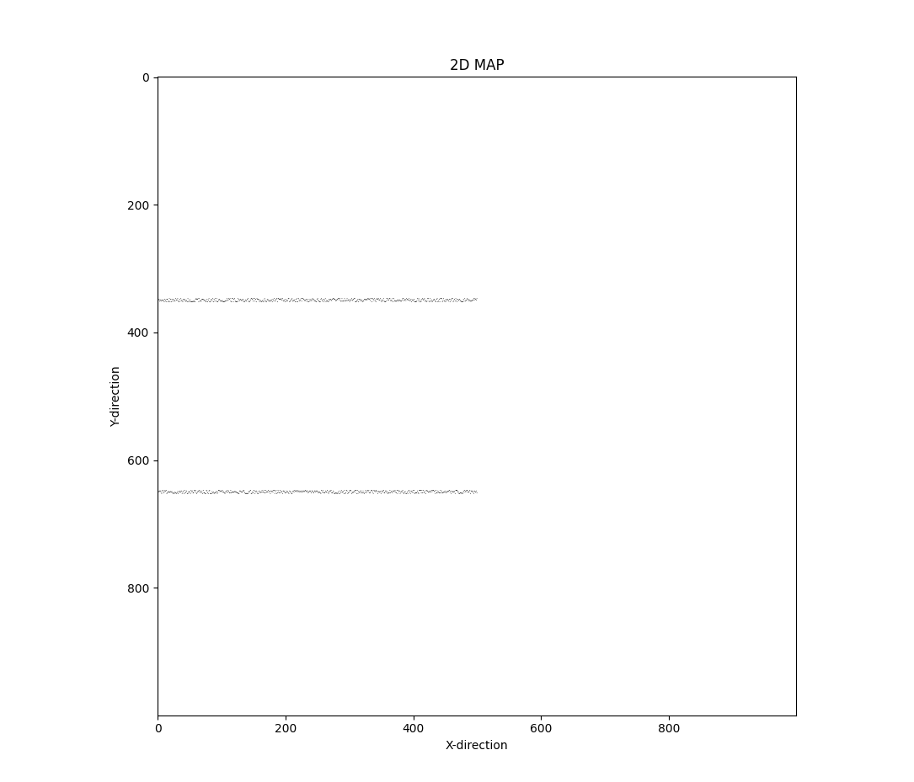
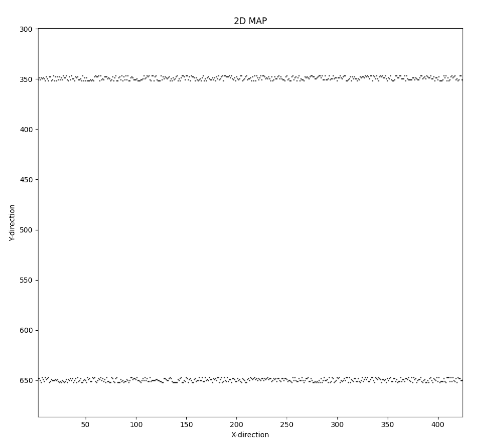
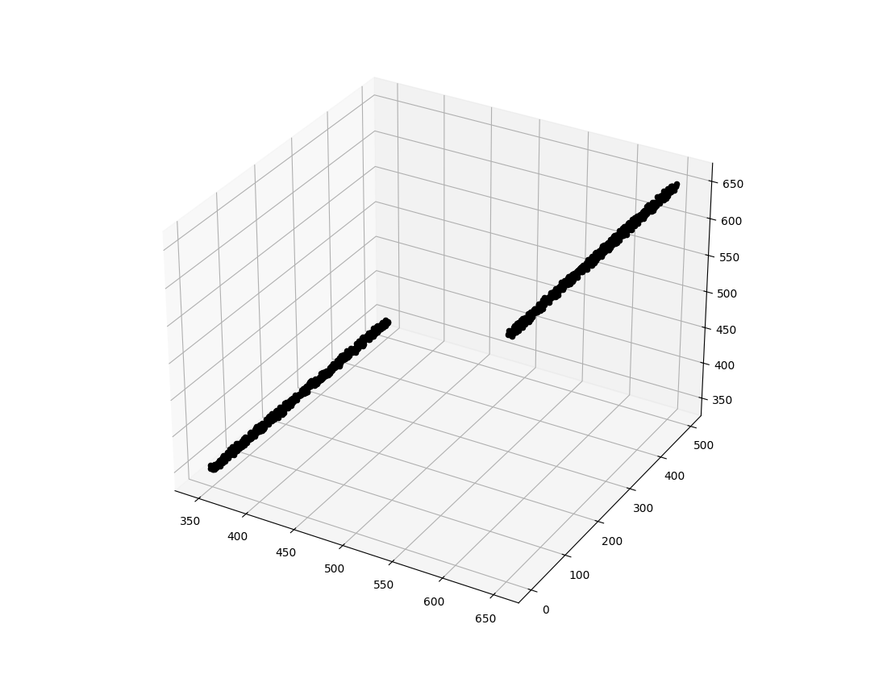
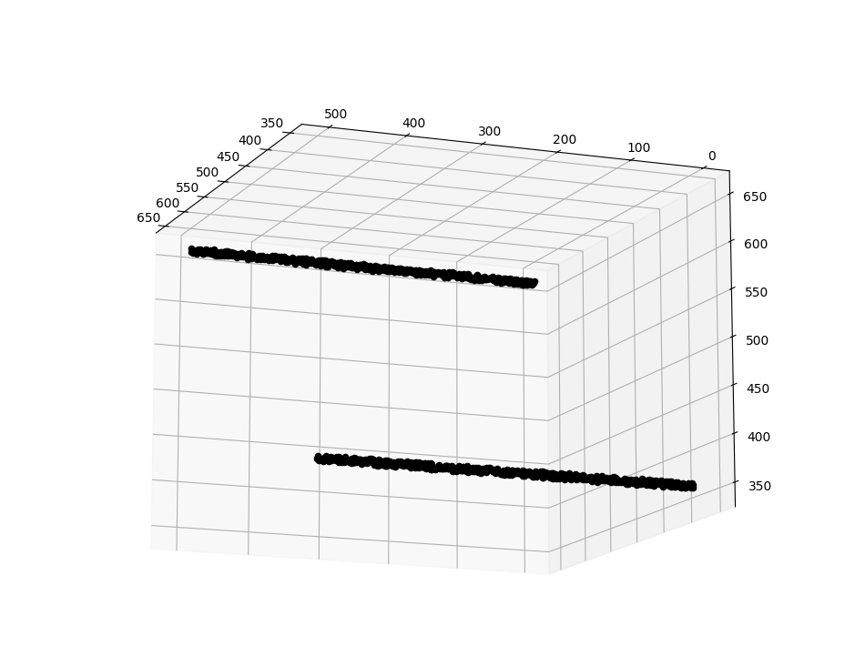

# Mapping In Python
A set of python programs to make a map (2D or 3D).

This repository contains python programs for using simple x, y and z co-ordinates to plot the results in either 2D (only x and y) and in 3D (x, y and z).
It can be used a make Graphes, Maps, Figures, Diagrams, Lines, Surfaces, Planes, Points and much more

If you find this Repository useful , please give it a star ⭐

## Images

### 2D Map





### 3D Map






## Setup and Running
1. First, clone the repository and navigate into it:
```bash
git clone https://github.com/blaiserods26/MappingInPython
```
2. Install the necessary dependencies:
```bash
pip install requirements.txt
```
3. To run the main script:
```bash
python3 2Dmap.py # or 3Dmap.py for 3D map
```
## Instructions for Inputs to run the program
For the 2D mapping program, the input has to be the x and y co-ordinates of the points.
Input Format:
0(X Co-ordinate < 1000)
0(Y Co-ordinate < 1000)
0(Counter !=  1 until all the points are inputed)
Note : The upper limit of the co-ordinates is 1000 but it can be changed in the code by changing the length of the array.
```c
 arr = [[0]*5000 for i in range(5000)] 
```

For the 3D mapping program, the input has to be the x, y and z co-ordinates of the points.
Input Format:
0(X Co-ordinate < 1000)
0(Y Co-ordinate < 1000)
0(Y Co-ordinate < 1000)
0(Counter !=  1 until all the points are inputed)
Note : The upper limit of the co-ordinates is 1000 but it can be changed in the code by changing the length of the array.
```c
 arr = [[[0]*5000 for i in range(5000)] for j in range (5000)]
```

## Sample Input 
Sample inputs are provided in the [input](input) folder.
## License
This project is licensed under the terms of the MIT license. See the [LICENSE](LICENCE) file for the full text of the license.
